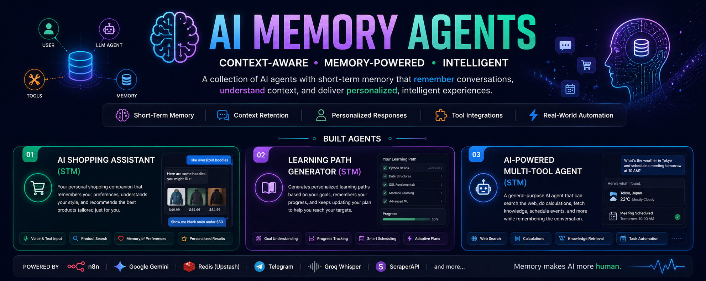

<p align="center">
  
</p>

<h1 align="center">🧠 AI Memory Agents</h1>

<p align="center">
Building AI systems that remember, adapt, and personalize every conversation.
</p>

<p align="center">


</p>

---

# 🚀 Overview

Modern AI systems are expected to do more than answer questions.

They should remember previous conversations, understand user preferences, maintain context across interactions, and deliver personalized experiences instead of treating every conversation as a completely new session.

This repository explores the development of **memory-enabled AI agents** using **Large Language Models**, **Redis-based conversational memory**, **workflow automation**, and **external tools**.

Each project demonstrates how memory transforms a traditional AI chatbot into an intelligent assistant capable of maintaining context and making better decisions over time.

Whether it's shopping, research, learning, or productivity, these agents are designed to behave more like persistent digital assistants than stateless chatbots.

---

# 🧠 Why Memory Matters

Traditional AI assistants have no memory.

Every interaction starts from zero.

That leads to:

- ❌ Repeated questions
- ❌ Forgotten preferences
- ❌ Generic responses
- ❌ Poor personalization
- ❌ Limited conversational continuity

Memory-enabled AI agents overcome these limitations by maintaining conversational context throughout a session.

Benefits include:

- ✅ Context-aware conversations
- ✅ Personalized recommendations
- ✅ Preference retention
- ✅ Smarter decision making
- ✅ More natural user interactions
- ✅ Improved user experience

---

# ✨ Features

- 🧠 Short-Term Conversational Memory
- 🤖 Google Gemini Powered AI
- ⚡ n8n Workflow Automation
- 💬 Telegram Integration
- 🎙️ Voice Processing
- 🔍 Tool Calling
- 🌐 External API Integration
- 📄 Intelligent Document Generation
- 🛒 Personalized Shopping Assistance
- 🔄 Context-Aware Conversations
- 🚀 Production-Ready Workflow Design

---

# 🏗 Memory Architecture

<p align="center">

</p>

```text
                 User

                  │

                  ▼

          Telegram / Chat Interface

                  │

                  ▼

              AI Agent (LLM)

        ┌─────────┴─────────┐

        ▼                   ▼

 Redis Conversation      External Tools
       Memory

        ▼                   ▼

 Personalized Context-Aware Response

                  │

                  ▼

                User
```

---

# 🤖 AI Memory Agent Collection

| Agent | Description | Memory | Status |
|-------|-------------|:------:|:------:|
| 🛍️ AI Shopping Assistant (STM) | Conversational shopping assistant with personalized recommendations | Redis | ✅ |
| 🔍 AI Research Assistant | Context-aware research companion | Planned | 🚧 |
| 💻 AI Coding Assistant | Remembers project discussions and coding context | Planned | 🚧 |
| 📚 AI Learning Coach | Tracks learning progress and adapts study plans | Planned | 🚧 |
| 📧 Email Assistant | Maintains conversation history while drafting emails | Planned | 🚧 |
| 🤝 Customer Support Agent | Personalized support with conversation memory | Planned | 🚧 |

---

# 🛠 Technology Stack

| Category | Technologies |
|-----------|--------------|
| Workflow Automation | n8n |
| Large Language Model | Google Gemini |
| Conversational Memory | Redis (Upstash) |
| Speech Recognition | Groq Whisper |
| Messaging Platform | Telegram Bot API |
| External APIs | HTTP Request, ScraperAPI |
| Programming Languages | JavaScript, Python |

---

# 📂 Repository Structure

```text
AI-Memory-Agents

│

├── README.md

├── LICENSE

├── assets/
│   ├── banner.png
│   ├── architecture/
│   └── screenshots/

├── agents/
│   ├── AI Shopping Assistant STM/
│   ├── AI Research Assistant/
│   ├── AI Coding Assistant/
│   ├── AI Learning Coach/
│   └── ...

└── docs/
```

---

# 📈 Learning Journey

This repository documents my progression through modern AI engineering concepts.

```text
Traditional Chatbots
        │
        ▼
Stateless AI Agents
        │
        ▼
Memory-Enabled AI Agents
        │
        ▼
Long-Term Memory Systems
        │
        ▼
Vector Database Memory
        │
        ▼
Retrieval-Augmented Generation (RAG)
        │
        ▼
Multi-Agent Systems
        │
        ▼
Autonomous AI Systems
```

Each project represents a step toward building more capable, context-aware AI systems.

---

# 🚀 Roadmap

## ✅ Completed

- AI Shopping Assistant (Short-Term Memory)

---

## 🚧 Currently Building

- AI Research Assistant
- AI Coding Assistant
- AI Learning Coach

---

## 📌 Planned

- Personal Finance Agent
- Resume Review Agent
- PDF Memory Agent
- Meeting Assistant
- Travel Planner
- Customer Support Agent
- Email Assistant
- Medical Information Assistant
- Multi-Agent Collaboration Framework

---

# 💡 Goals of this Repository

- Build practical memory-enabled AI systems
- Explore conversational memory architectures
- Experiment with LLM tool orchestration
- Develop reusable workflow templates
- Learn production-ready AI engineering practices
- Share open-source AI agent implementations

---

# 🤝 Contributions

Contributions, suggestions, and discussions are always welcome.

If you have ideas for improving existing agents or building new memory-enabled AI systems, feel free to open an Issue or submit a Pull Request.

---

# 📄 License

This repository is licensed under the MIT License.

---

<p align="center">

### 🧠 "Intelligence answers questions. Memory builds relationships."

Building the next generation of context-aware AI systems.

</p>
