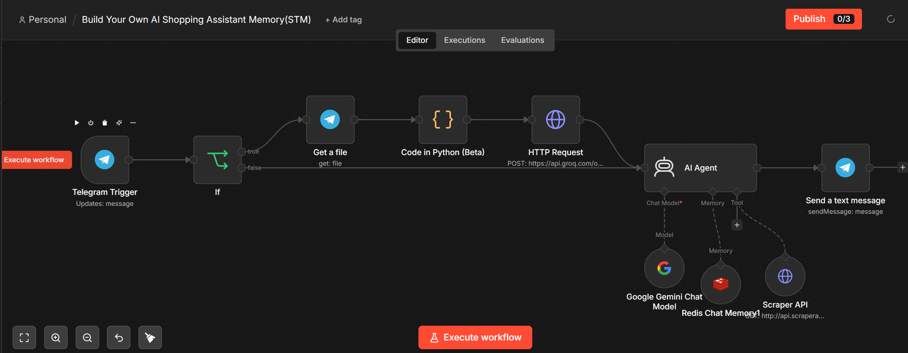

# 🛍️ AI Shopping Assistant (STM)

> A memory-enabled AI shopping assistant that understands voice and text, remembers conversations, provides personalized styling advice, and performs real-time Amazon product searches using Google Gemini and Redis Short-Term Memory.

<p align="left">


</p>

---

# 📖 Overview

The **AI Shopping Assistant (STM)** is an intelligent shopping and styling assistant designed to deliver personalized shopping experiences through natural conversations.

Unlike traditional shopping chatbots, this agent leverages **Redis-based Short-Term Memory (STM)** to maintain conversational context throughout a session. It remembers user preferences, understands follow-up questions, and provides more relevant recommendations without repeatedly asking for the same information.

The assistant supports both **voice and text interactions**, automatically transcribes voice messages using **Groq Whisper**, reasons with **Google Gemini**, performs live Amazon searches through **ScraperAPI**, and delivers personalized responses directly in Telegram.

---

# 🆕 What's New in the STM Version

This project is an enhanced version of the original **AI Shopping Assistant**.

### Memory Enhancements

- 🧠 Redis Short-Term Memory
- 💬 Multi-turn conversations
- 🎯 Personalized shopping recommendations
- 🛒 Remembers previous product preferences
- 👕 Context-aware styling advice
- 🔄 Session-based conversation history
- ⚡ Reduced repetitive interactions

Instead of treating every message as a new conversation, the assistant now understands context across an entire shopping session.

---

# ✨ Features

- 🛍️ AI-powered shopping assistant
- 🎙️ Voice message support
- 💬 Text conversations
- 🧠 Short-Term Memory using Redis
- 🤖 Google Gemini reasoning
- 🛒 Live Amazon product search
- 👗 Personalized fashion & styling advice
- 🌐 Web scraping for real-time product information
- 📱 Telegram integration
- ⚡ Automated workflow with n8n

---

# 🏗️ Architecture

<p align="center">

</p>

---

# 📸 Workflow

<p align="center">

</p>

---

# ⚙️ How It Works

1. The user sends a **voice message** or **text message** through Telegram.
2. Voice messages are automatically transcribed using **Groq Whisper**.
3. The AI Agent receives the user's request.
4. Redis Short-Term Memory provides previous conversation context.
5. Google Gemini understands the user's intent.
6. Depending on the request, the agent:
   - Searches Amazon products using ScraperAPI.
   - Provides personalized styling advice.
   - Continues previous conversations using stored context.
7. The assistant sends an intelligent, context-aware response back to Telegram.

---

# 🧠 Memory Enhancement

Traditional shopping assistants respond only to the current message.

This version introduces a conversational memory layer using **Redis (Upstash)**.

### Without Memory

- ❌ Repeated questions
- ❌ No personalization
- ❌ Forgotten preferences
- ❌ Generic recommendations

### With Short-Term Memory

- ✅ Remembers shopping preferences
- ✅ Understands follow-up questions
- ✅ Context-aware conversations
- ✅ Personalized recommendations
- ✅ Better shopping experience

---

# 🛠️ Technology Stack

| Category | Technology |
|-----------|------------|
| Workflow Automation | n8n |
| Large Language Model | Google Gemini |
| Conversational Memory | Redis (Upstash) |
| Speech Recognition | Groq Whisper |
| Messaging Platform | Telegram Bot API |
| Product Search | ScraperAPI |
| Shopping Platform | Amazon India |
| Programming | Python, JavaScript |

---

# 📂 Project Structure

```text
AI Shopping Assistant (STM)

├── README.md
├── workflow.json
└── workflow.png
```

---

# 💬 Example Conversation

### User

> I'm looking for white sneakers under ₹3000.

### Assistant

> Here are some highly rated white sneakers within your budget along with prices, ratings, and purchase links.

---

### User

> Show me something that matches my previous choice.

### Assistant

> Based on your earlier preference for minimalist white sneakers, here are similar options with better cushioning and customer ratings.

The assistant remembers the previous conversation instead of asking the same questions again.

---

# 🚀 Future Improvements

- Long-Term Memory using Vector Databases
- Wishlist Management
- Multi-store Price Comparison
- Image-based Product Search
- Voice Response Generation
- Personalized Shopping Profiles
- Order Tracking Integration
- Recommendation Engine

---

# 🔗 Related Project

This project is the **memory-enhanced version** of the original **AI Shopping Assistant**.

The original implementation demonstrates a stateless conversational shopping assistant, while this version introduces **Redis Short-Term Memory (STM)** to enable context-aware and personalized shopping experiences.

---

# 📄 License

This project is licensed under the **MIT License**.

---

<div align="center">

### 🧠 "Great shopping assistants answer questions. Memory-enabled assistants understand people."

⭐ If you found this project helpful, consider giving the repository a star.

</div>
