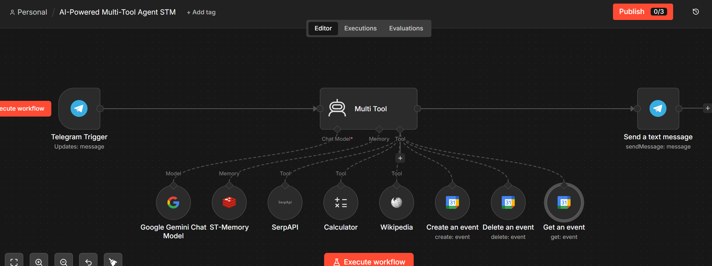

# 🛠️ AI-Powered Multi-Tool Agent (STM)

> A memory-enabled AI assistant capable of intelligent tool selection, real-time web search, calculations, knowledge retrieval, and context-aware conversations using Google Gemini and Redis Short-Term Memory.

<p align="left">


</p>

---

# 📖 Overview

The **AI-Powered Multi-Tool Agent (STM)** is an intelligent conversational assistant designed to solve a wide variety of user tasks through dynamic tool selection and conversational memory.

Unlike traditional assistants that process each request independently, this version integrates **Redis Short-Term Memory (STM)**, allowing the agent to remember previous interactions, maintain conversational context, and provide more relevant responses throughout a session.

The AI Agent analyzes each request, determines whether external tools are required, invokes the appropriate services, and combines their outputs into a natural, context-aware response.

---

# 🆕 What's New in the STM Version

This project extends the original **AI-Powered Multi-Tool Agent** by introducing a Redis-powered memory layer.

### Memory Enhancements

- 🧠 Short-Term Conversation Memory
- 💬 Multi-turn conversations
- 🎯 Context-aware tool selection
- 🔄 Session-based conversation history
- 🤖 Personalized responses
- ⚡ Reduced repetitive prompts
- 🚀 Smarter decision making

Instead of handling every prompt as an isolated request, the agent now remembers the ongoing conversation and uses previous interactions to improve future responses.

---

# ✨ Features

- 🤖 Intelligent AI assistant
- 🧠 Redis Short-Term Memory
- 🌐 Real-time web search
- 📚 Knowledge retrieval
- ➗ Mathematical calculations
- 📅 Calendar assistance
- 🔧 Dynamic tool selection
- 💬 Context-aware conversations
- 📱 Telegram integration
- ⚡ Automated workflow using n8n

---

# 🏗️ Architecture

<p align="center">

</p>

---

# 📸 Workflow

<p align="center">

</p>

---

# ⚙️ How It Works

1. The user sends a request through Telegram.
2. The AI Agent receives the prompt.
3. Redis Short-Term Memory retrieves previous conversation context.
4. Google Gemini analyzes the user's intent.
5. The AI Agent determines whether external tools are required.
6. The appropriate tool is automatically selected and executed.
7. Tool outputs are combined with conversational context.
8. The agent generates a personalized response and sends it back to the user.

---

# 🧠 Memory Enhancement

Traditional AI assistants process only the current message.

This version introduces a conversational memory layer using **Redis (Upstash)**.

### Without Memory

- ❌ Every prompt starts from scratch
- ❌ No conversational continuity
- ❌ Repeated explanations
- ❌ Generic responses
- ❌ Limited personalization

### With Short-Term Memory

- ✅ Understands previous conversations
- ✅ Maintains session context
- ✅ Better tool selection
- ✅ Personalized responses
- ✅ Natural multi-turn conversations

Memory enables the assistant to make more informed decisions while interacting naturally across multiple exchanges.

---

# 🛠️ Technology Stack

| Category | Technology |
|-----------|------------|
| Workflow Automation | n8n |
| Large Language Model | Google Gemini |
| Conversational Memory | Redis (Upstash) |
| Messaging Platform | Telegram Bot API |
| Search Engine | SerpAPI |
| Knowledge Base | Wikipedia |
| Productivity | Google Calendar |
| Utility | Calculator Tool |
| Programming | JavaScript |

---

# 📂 Project Structure

```text
AI-Powered Multi-Tool Agent (STM)

├── README.md
├── workflow.json
└── workflow.png
```

---

# 💬 Example Conversation

### User

> Find the latest AI news.

### Assistant

> Here are today's major AI developments along with a summary of each headline.

---

### User

> Which one do you think is most important?

### Assistant

> Based on the articles we just discussed, the OpenAI announcement is likely the most impactful because it directly affects developers building AI applications.

Instead of asking which news article the user is referring to, the assistant remembers the previous conversation and responds naturally.

---

### User

> Calculate 18% of 24,500.

### Assistant

> 18% of ₹24,500 is ₹4,410.

---

### User

> Add that to yesterday's total.

### Assistant

The assistant understands what "that" refers to because the previous calculation is still available in memory.

---

# 🚀 Future Improvements

- Long-Term Memory using Vector Databases
- Gmail Integration
- Google Drive Integration
- PDF Understanding
- Image Analysis
- Voice Conversations
- Weather API Integration
- Multi-Agent Collaboration

---

# 🔗 Related Project

This project is the **memory-enhanced version** of the original **AI-Powered Multi-Tool Agent**.

The original implementation demonstrates intelligent tool orchestration, while this version extends those capabilities with **Redis Short-Term Memory (STM)** to enable context-aware conversations and more personalized interactions.

---

# 📄 License

This project is licensed under the **MIT License**.

---

<div align="center">

### 🧠 "The best AI assistants don't just use tools—they remember how they've helped you."

⭐ If you found this project useful, consider giving the repository a star.

</div>
