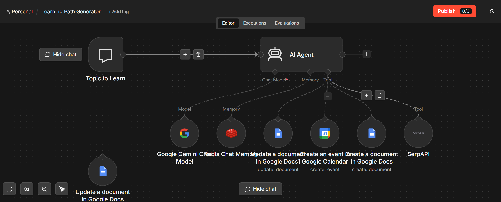

# 📚 Learning Path Generator (STM)

> A memory-enabled AI learning assistant that generates personalized learning roadmaps, researches high-quality resources, creates Google Docs, schedules study sessions in Google Calendar, and remembers learning context using Redis Short-Term Memory.

<p align="left">


</p>

---

# 📖 Overview

The **Learning Path Generator (STM)** is an intelligent AI learning assistant that creates structured, personalized learning roadmaps from a user's learning goal.

Unlike the original stateless version, this enhanced implementation introduces **Redis Short-Term Memory (STM)**, allowing the agent to remember learning objectives, previous discussions, and planning decisions throughout the conversation.

The agent researches learning resources using live web search, organizes a day-wise curriculum, automatically generates Google Docs containing the complete roadmap, and schedules study sessions directly in Google Calendar.

By maintaining conversational context, the assistant delivers a more natural and personalized learning experience without repeatedly asking the same questions.

---

# 🆕 What's New in the STM Version

This project extends the original **Learning Path Generator** by integrating **Redis (Upstash)** as a conversational memory layer.

### Memory Enhancements

- 🧠 Remembers learning goals
- 📚 Maintains conversation history
- 🎯 Context-aware curriculum planning
- 🔄 Personalized follow-up recommendations
- ⚡ Reduced repetitive prompts
- 💬 Multi-turn conversations
- 🚀 Improved learning assistance

Instead of treating every request independently, the agent now builds upon previous interactions to create more relevant and personalized learning plans.

---

# ✨ Features

- 📚 Personalized learning roadmap generation
- 🧠 Redis Short-Term Memory
- 🤖 Google Gemini reasoning
- 🌐 Live resource discovery using SerpAPI
- 📄 Automatic Google Docs creation
- 📅 Google Calendar scheduling
- 💬 Context-aware conversations
- ⚡ End-to-end workflow automation
- 🎯 Personalized study planning

---

# 🏗️ Architecture

<p align="center">

</p>

---

# 📸 Workflow

<p align="center">

</p>

---

# ⚙️ How It Works

1. The user provides a learning goal through the chat interface.
2. Redis Short-Term Memory retrieves previous conversation context.
3. Google Gemini analyzes the user's objective.
4. The AI Agent generates a structured day-wise curriculum.
5. SerpAPI discovers relevant learning resources.
6. Google Docs automatically creates a detailed learning guide.
7. Google Calendar schedules study sessions.
8. The personalized learning roadmap is delivered to the user.

---

# 🧠 Memory Enhancement

Traditional learning assistants generate a roadmap based only on the current prompt.

This version introduces **Redis Short-Term Memory**, enabling the assistant to remember previous discussions and personalize future interactions.

### Without Memory

- ❌ Every conversation starts from scratch
- ❌ Learning goals are forgotten
- ❌ Repeated planning
- ❌ No conversational continuity
- ❌ Generic recommendations

### With Short-Term Memory

- ✅ Remembers learning objectives
- ✅ Understands follow-up requests
- ✅ Maintains planning context
- ✅ Personalized recommendations
- ✅ Natural multi-turn learning conversations

The addition of conversational memory allows the assistant to provide a smoother and more intelligent learning experience.

---

# 🛠️ Technology Stack

| Category | Technology |
|-----------|------------|
| Workflow Automation | n8n |
| Large Language Model | Google Gemini |
| Conversational Memory | Redis (Upstash) |
| Search Engine | SerpAPI |
| Documentation | Google Docs API |
| Scheduling | Google Calendar API |
| Programming | JavaScript |

---

# 📂 Project Structure

```text
Learning Path Generator (STM)

├── README.md
├── workflow.json
└── workflow.png
```

---

# 💬 Example Conversation

### User

> I want to learn Cloud Computing in 30 days.

### Assistant

> I'll prepare a structured 30-day roadmap with daily topics, learning resources, Google Docs, and study sessions in your Google Calendar.

---

### User

> Increase networking practice during the last week.

### Assistant

> I've updated your learning plan to include additional networking labs and practical exercises during the final week.

---

### User

> Add Kubernetes after Docker.

### Assistant

> Done! I've adjusted the curriculum so Kubernetes follows Docker and updated your study schedule accordingly.

Instead of rebuilding the roadmap from scratch, the assistant remembers the existing plan and updates it intelligently.

---

# 🚀 Future Improvements

- Long-Term Memory using Vector Databases
- Progress Tracking Dashboard
- Quiz Generation
- Adaptive Difficulty Adjustment
- Notion Integration
- PDF Export
- Learning Analytics
- Multi-language Support

---

# 🔗 Related Project

This project is the **memory-enhanced version** of the original **Learning Path Generator**.

The original implementation focused on automated curriculum generation, while this version extends those capabilities with **Redis Short-Term Memory (STM)** to create personalized, context-aware learning experiences.

---

# 📄 License

This project is licensed under the **MIT License**.

---

<div align="center">

### 🧠 "Great learning assistants create plans. Memory-enabled learning assistants grow with the learner."

⭐ If you found this project useful, consider giving the repository a star.

</div>
